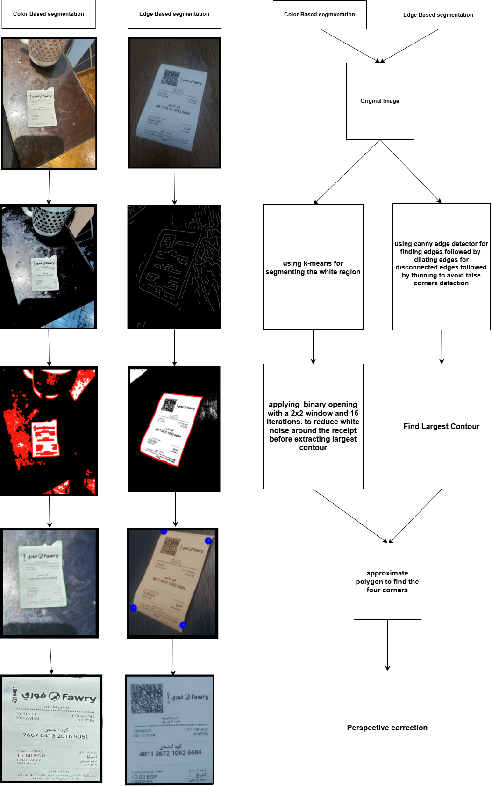
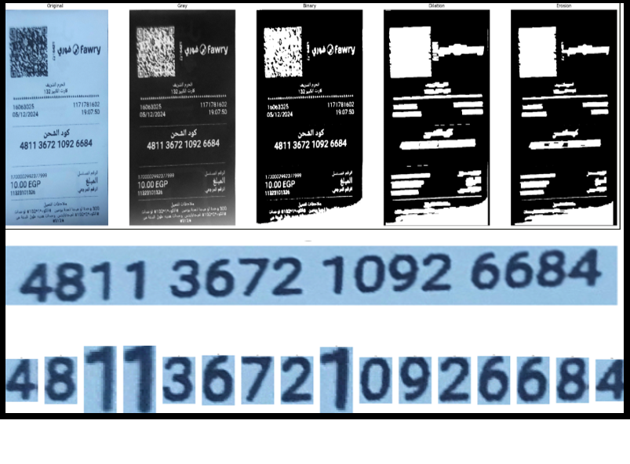
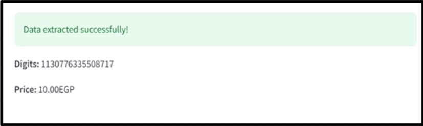

# Fawry Receipt OCR
## Overview 
FawryVision is an image processing system designed to help users quickly and accurately extract a Fawry 16-digit code from receipts, Balance Recharge Code   typically used to recharge phone credit. This system aims to reduce the challenges associated with manually reading and entering these codes, which can be difficult for individuals with vision impairments or prone to human error. By leveraging image processing techniques, FawryVision automatically identifies, isolates, and displays the code for easy input, minimizing the potential for misreading digits due to poor print quality, low lighting, or user oversight.

NOTE: This project emphasizes classical image processing techniques to maximize efficiency  and avoid reliance on deep learning. 

## Implementation

### 1. Reciept Segmentation
We explored two approaches for extracting the receipt from a noisy background. The first approach involved edge segmentation, which proved ineffective on highly noisy images. As an improvement, we employed color-based segmentation using k-means clustering.



### 2. Information Extraction
Template matching is used to detect the 16-digit code associated with the reciept price .





### 3. Code and Price text generation


### 4. Measuring Accuracy
A deep learning pipeline using PyTesseract's pre-trained OCR model has been integrated into the project to evaluate our results.
# Set Up

```shell
pip install -r requirements.txt
# In case of dependency error
# pip install opencv-python numpy scikit-image scipy pillow pytesseract pandas streamlit matplotlib
```

---

## How to run?
---

We have **2 Pipelines** for the OCR process each one has a different approach to extract the receipt:

1. **Pipeline 1 & 2** - fawry.ipynb & segmentation.ipynb:
   - **Approach**:
     - **Step 1**: Extract the receipt from the image using the **Fawry Logo** as a reference point.
     - **Step 2**: Extract the text from the receipt using **Tesseract OCR**.
   - **How to run**:
     - **Step 1**: You can find the cell where you can specify the path to the image and run all cells.
     - **Step 2**: At the end of the notebook, you will find a cell that will
       1. Run all images (from 10 to 35)
       2. Save the 16 digits in `results` folder (inside code folder)
       3. A visualization of the results will be displayed in as an output for this cell (last cell).
2. **GUI!** - Streamlit:

   - **Approach**:
     - **Step 1**: Upload the image.
     - **Step 2**: Extract the text from the receipt using one of the following opions
       1. **Pipeline 1**.
       2. **Pipeline 2**.
       3. **Tesseract OCR**.
   - **How to run**:

     1. **Step 1**: Run the following command in the terminal.
        ```shell
        streamlit run code/gui/app.py
        ```
     2. **Step 2**: (optional if you want to try pretrained model ) Download Tesseract : https://sourceforge.net/projects/tesseract-ocr.mirror/

     3. **Step 2**: Open the link in the browser.
     4. **Step 3**: Upload the image and choose the pipeline.
     5. **Step 4**: The extracted 16 digits, will be displayed in the browser.

   - **Note**: The GUI will be running on the local machine.

---
